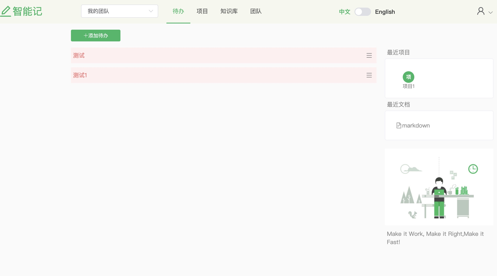
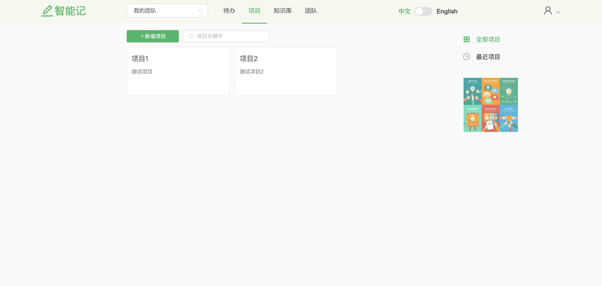
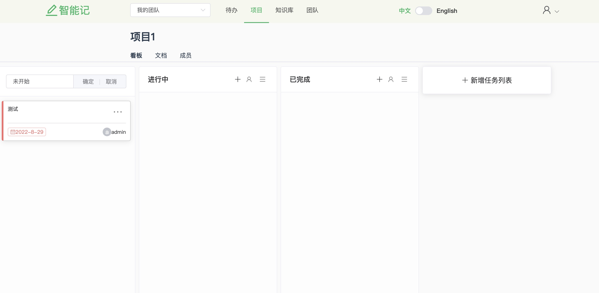
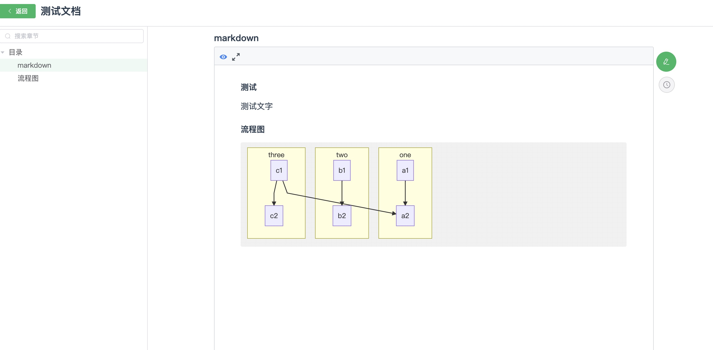

# ZNJ[智能记] 中小团队协作工具

#### 🎉 简介

基于文档的团队协作工具

- 支持待办事项管理
- 支持项目任务管理
- 支持 markdown
- 支持流程图文档
- 文档修改保存历史记录

#### 🚀 源码安装

```bash
git clone https://github.com/itmisx/znj
cd znj/web_src
yarn install
yarn build
cd ../
go mod tidy
GOOS=linux GOARCH=amd64 go build -o znj main.go
# 可以自定义配置 /etc/znj.yaml
./znj
```

#### 🚀 Docker

```bash
git clone https://github.com/itmisx/znj
cd znj/docker
# 自定义配置文件
# 编辑docker-compose.yaml
# volumes:
#  - ./etc/znj.yaml:/etc/znj.yaml
docker-compose up -d
```

> docker-compose 参考

```yaml
version: "3.7"
services:
  znj:
    image: smally84/znj:0.0.1
    container_name: znj
    ports:
      - 9000:9000
    # 自定义配置文件
    volumes:
      - ./etc/znj.yaml:/etc/znj.yaml
    restart: always
    logging:
      driver: json-file
      options:
        max-size: "200k"
        max-file: "10"
```

> 配置文件参考

```yaml
#应用配置
http_port: ":9000"
default_lang: zh
upload_limit:
allow_headers:
  - "Authorization"
  - "Token"
allow_methods:
  - "OPTIONS"
# mysql配置
mysql:
  host: "127.0.0.1"
  port: "3306"
  username: "root"
  password: "123456"
  database: "znj"
  debug: true
logger:
  debug: true
  output: "console"
  file: "./logs/run.log"
  max_size: 100 #mb
  rotate: "0 0 0 * * *" #每天 0 零点切割日志
# redis配置
redis:
  host: "127.0.0.1"
  protocol: "tcp"
  port: "6379"
# 系统初始化管理员
admin_user:
  username: "admin"
```

#### 🎉 截图







#### LICENSE
